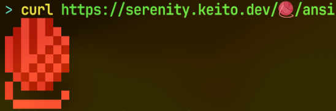
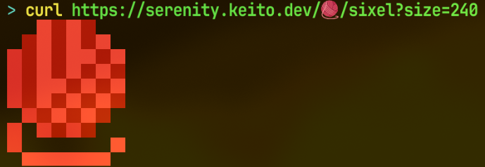
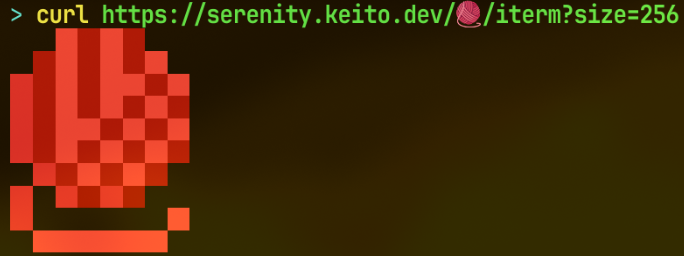
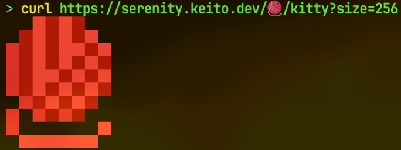

# SerenityOS Emoji

Re-serves [SerenityOS](https://github.com/SerenityOS/serenity) emoji as images, data, terminal graphics, and fonts. https://serenity.keito.dev


> SerenityOS emoji set is a fantastic pixel art set built for SerenityOS but now available for everyone, each glyph is at most 10x10px.
> [emoji.serenityos.org](https://emoji.serenityos.org/)

## Formats

- images ([PNG](#png-emojipng), [SVG](#svg-emojisvg), [ICO](#ico-emojiico))
- data ([JSON](#json-emojijson), [CSV](#csv-emojicsv))
- terminal graphics ([ANSI](#ansi-emojiansi), [Sixel](#sixel-emojisixel), [Inline Images](#inline-images-protocol-emojiiterm), [kitty graphics](#kitty-graphics-protocol-emojikitty))
- a [webfont](#stylesheet-serenity-emojicss) (TTF, WOFF)

### PNG `/{emoji}/png`

A lossless raster image.


| Parameter | Default | Description                                                      |
| --------- | ------- | ---------------------------------------------------------------- |
| `size`    | `512`   | longer side in px, 1 to 2048, aspect kept                        |
| `square`  | off     | pad to a centered square with transparent margins, via `?square` |

### SVG `/{emoji}/svg`

Vector output, one `<rect>` for each run of same-colored pixels.


```xml
<svg xmlns="http://www.w3.org/2000/svg" viewBox="0 0 8 10" width="8" height="10" shape-rendering="crispEdges">
  <rect x="2" y="0" width="1" height="1" fill="#ff3e3e" />
  ...
</svg>
```

| Parameter | Default | Description                                             |
| --------- | ------- | ------------------------------------------------------- |
| `size`    | native  | sets `width` and `height`, leaving the `viewBox` alone  |
| `square`  | off     | center the content in a square `viewBox`, via `?square` |

### ICO `/{emoji}/ico`

A favicon, a PNG tucked inside an ICO container.


| Parameter | Default | Description                                                      |
| --------- | ------- | ---------------------------------------------------------------- |
| `size`    | `256`   | longer side in px, capped at 256                                 |
| `square`  | off     | pad to a centered square with transparent margins, via `?square` |

```html
<link rel="icon" href="https://serenity.keito.dev/🧶/ico" />
```

### JSON `/{emoji}/json`

The pixel grid as `colors[y][x]`.

```json
[[{"r":0,"g":0,"b":0,"a":0},{"r":0,"g":0,"b":0,"a":0},{"r":255,"g":62,"b":62,"a":255}, ...], ...]
```

```json
[["#00000000", "#00000000", "#ff3e3eff", ...], ...]
```

| Parameter | Default  | Description                                                    |
| --------- | -------- | -------------------------------------------------------------- |
| `format`  | `object` | how each color is written (see below)                          |
| `size`    | native   | longer side in px, 1 to 2048, aspect kept                      |
| `square`  | off      | pad to a centered square with transparent cells, via `?square` |

Channels run 0 to 255, and the CSS function forms put alpha in 0 to 1. The table shows `rgba(255, 0, 0, 128)` in every format.

| `format` | Cell                                   |
| -------- | -------------------------------------- |
| `object` | `{"r":255,"g":0,"b":0,"a":128}`        |
| `array`  | `[255,0,0,128]`                        |
| `hex`    | `"#ff000080"`                          |
| `rgb`    | `"rgb(255 0 0 / 0.502)"`               |
| `rgba`   | `"rgba(255, 0, 0, 0.502)"`             |
| `hsl`    | `"hsl(0 100% 50% / 0.502)"`            |
| `hwb`    | `"hwb(0 0% 0% / 0.502)"`               |
| `lab`    | `"lab(54.29% 80.8 69.89 / 0.502)"`     |
| `lch`    | `"lch(54.29% 106.84 40.86 / 0.502)"`   |
| `oklab`  | `"oklab(0.628 0.2249 0.1258 / 0.502)"` |
| `oklch`  | `"oklch(0.628 0.2577 29.23 / 0.502)"`  |

### CSV `/{emoji}/csv`

The same grid as text, one row per line.

```csv
#00000000,#00000000,#ff3e3eff,#b30808ff,#ff3e3eff,#b30808ff,#00000000,#00000000
#00000000,#b30808ff,#ff3e3eff,#b30808ff,#ff3e3eff,#b30808ff,#ff3e3eff,#00000000
...
```

| Parameter   | Default | Description                                                          |
| ----------- | ------- | -------------------------------------------------------------------- |
| `format`    | `hex`   | any string format from JSON above, so not `object` or `array`        |
| `separator` | `,`     | what goes between cells; a cell containing it gets quoted (RFC 4180) |
| `size`      | native  | longer side in px, 1 to 2048, aspect kept                            |
| `square`    | off     | pad to a centered square with transparent cells, via `?square`       |

### ANSI `/{emoji}/ansi`

Truecolor half-block art for your terminal.



| Parameter | Default | Description                                                      |
| --------- | ------- | ---------------------------------------------------------------- |
| `size`    | native  | longer side in px, 1 to 2048, aspect kept                        |
| `square`  | off     | pad to a centered square with transparent margins, via `?square` |

### Sixel `/{emoji}/sixel`

A DEC sixel image, for terminals that support it like foot, WezTerm, or iTerm2.



| Parameter | Default | Description                                                      |
| --------- | ------- | ---------------------------------------------------------------- |
| `size`    | `512`   | longer side in px, 1 to 2048, aspect kept                        |
| `square`  | off     | pad to a centered square with transparent margins, via `?square` |

### Inline Images Protocol `/{emoji}/iterm`

iTerm2's Inline Images Protocol, carried over OSC 1337, for terminals that support it like iTerm2 or WezTerm.



| Parameter | Default | Description                                                      |
| --------- | ------- | ---------------------------------------------------------------- |
| `size`    | `512`   | longer side in px, 1 to 2048, aspect kept                        |
| `square`  | off     | pad to a centered square with transparent margins, via `?square` |

### kitty graphics protocol `/{emoji}/kitty`

kitty's graphics protocol, officially the Terminal graphics protocol, carried over APC, for terminals that support it like kitty, WezTerm, or Ghostty.



| Parameter | Default | Description                                                      |
| --------- | ------- | ---------------------------------------------------------------- |
| `size`    | `512`   | longer side in px, 1 to 2048, aspect kept                        |
| `square`  | off     | pad to a centered square with transparent margins, via `?square` |

### Stylesheet `/serenity-emoji.css`

A ready-made `@font-face` for the whole set, a COLR color font.

```html
<link rel="stylesheet" href="https://serenity.keito.dev/serenity-emoji.css" />
<span style="font-family: 'Serenity Emoji'">🧶</span>
```

### Font file `/font/serenity-emoji.{subset}.{format}`

The TTF or WOFF the stylesheet points at, one file per subset.

| Parameter  | Description                                                        |
| ---------- | ------------------------------------------------------------------ |
| `{subset}` | a group below, `full`, `text`, or a range like `1f600-1f64f`       |
| `{format}` | `woff` or `ttf`                                                    |
| `?text=`   | with the `text` subset, the characters to cover, e.g. `?text=🧶🔥` |

| Subset            | Code points | Examples                                                                                                                                                              |
| ----------------- | ----------- | --------------------------------------------------------------------------------------------------------------------------------------------------------------------- |
| `smileys-emotion` | 163         |  |
| `people-body`     | 158         |  |
| `animals-nature`  | 155         |  |
| `food-drink`      | 129         |  |
| `travel-places`   | 219         |  |
| `activities`      | 85          |  |
| `objects`         | 265         |  |
| `symbols`         | 212         |  |
| `flags`           | 5           |  |
| `component`       | 9           |                                                         |
| `full`            | all         |                                                                                                                                                                       |

## CLI

```sh
nix run github:mst-mkt/serenity-emoji#cli -- render ansi 🧶
nix profile install github:mst-mkt/serenity-emoji#cli
```

### Render `serenity-emoji render {format} {emoji}`

An emoji in the chosen format, on stdout.

```sh
serenity-emoji render ansi 🧶
serenity-emoji render image 🧶
serenity-emoji render png 🧶 > yarn.png
serenity-emoji render json 🧶 | jq '.[0]'
```

The emoji can be the character itself, its code points, or a shortcode.

```sh
serenity-emoji render ansi 🧶
serenity-emoji render ansi U+1F9F6
serenity-emoji render ansi :yarn:
```

The format is one of `png`, `svg`, `ico`, `json`, `csv`, `ansi`, or `image`. `image` picks a terminal graphics protocol.

| Option           | Default                                          | Description                                                                                                                     |
| ---------------- | ------------------------------------------------ | ------------------------------------------------------------------------------------------------------------------------------- |
| `--size`         | native, 512 for `png` and `image`, 256 for `ico` | longer side in px, 1 to 2048, aspect kept                                                                                       |
| `--square`       | off                                              | pad to a centered square with transparent margins                                                                               |
| `--emoji-dir`    | the API                                          | a local [`Base/res/emoji`](https://github.com/SerenityOS/serenity/tree/master/Base/res/emoji) checkout to read the artwork from |
| `--color-format` | `object` for `json`, `hex` for `csv`             | how each color is spelled                                                                                                       |
| `--separator`    | `,`                                              | column separator for `csv`                                                                                                      |
| `--protocol`     | detected                                         | `kitty`, `iterm`, or `sixel` for `image`                                                                                        |

### Build `serenity-emoji build {emoji-dir} {out-dir}`

```sh
serenity-emoji build ~/serenity/Base/res/emoji ./fonts
```

The output is one `serenity-emoji.{subset}.ttf` and `.woff` per subset, plus a `manifest.json` pairing each subset with its `unicode-range`.

| Option          | Default | Description                                                                    |
| --------------- | ------- | ------------------------------------------------------------------------------ |
| `--color-table` | `colr`  | `colr` for vector color layers, or `cbdt` for 128px pixel bitmaps (`ttf` only) |

## System Font

The font as a Nix package, to install as a system font.

### NixOS

```nix
{
  fonts.packages = [ inputs.serenity-emoji.packages.${pkgs.system}.font ];
  fonts.fontconfig.defaultFonts.emoji = [ "Serenity Emoji" ];
}
```

### Home Manager

```nix
{
  home.packages = [ inputs.serenity-emoji.packages.${pkgs.system}.font ];
  fonts.fontconfig.defaultFonts.emoji = [ "Serenity Emoji" ];
}
```

## License

This project is [MIT](./LICENSE).

The emoji are the SerenityOS developers' work, under [BSD-2-Clause](https://github.com/SerenityOS/serenity/blob/master/LICENSE), from [`Base/res/emoji`](https://github.com/SerenityOS/serenity/tree/master/Base/res/emoji). That license is embedded in every response.

- in the response headers (a `Link` with `rel="license"`)
- in the file metadata (PNG `tEXt`, SVG `<metadata>`, or the font `name` table)
